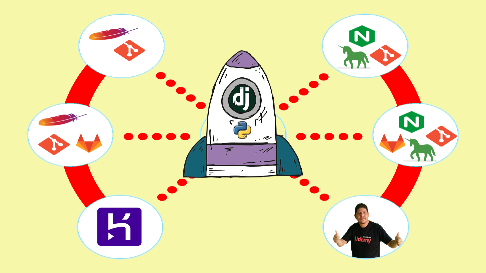

# Curso Despliegua Aplicaciones Django (y Flask) de Python en Varias Plataformas VPS 🐍 
##  🎖️ [Obténlo con hasta 50% Descuento Oficial en Udemy](https://www.udemy.com/course/despliegue-de-aplicaciones-django-en-varias-plataformas-vps/?referralCode=2FA7782A4B4B6B14A6E6)  🎖️

##### Código Fuente del Proyecto

### 💥 Descuento de hasta 50% 💓
##### Precio $9.99 en cualquier curso

## ☷ Cursos ofrecidos con su Descuento:

☞ Sistema de Compra y Facturación con Django LTS
☞ Elabora RestAPI con Django Rest FrameWork
☞ Domina el ORM de Django
☞ Desarrollo Web con Python usando Django (Para Principiantes)
☞ Replicación de Datos con SymmetricDS
☞ Experto FrontEnd con VUE y BackEnd con Django 
☞ Desarrolla Aplicaciones en Capa con ADO NET
☞ Entity FrameWork para principiantes

##  [Más Cursos y Descuentos al precio oficial de Udemy](https://mailchi.mp/1fc9a9e05a5c/debs-8-cursos-oficial) 

## ☝ ☝ ☝ ☝ ☝ ☝ ☝☝

##  [👉 Descuento Precio Más Bajo desde USD 9.99 👈](https://mailchi.mp/ffe98a904854/mejor-precio-cursos-udemy) 
